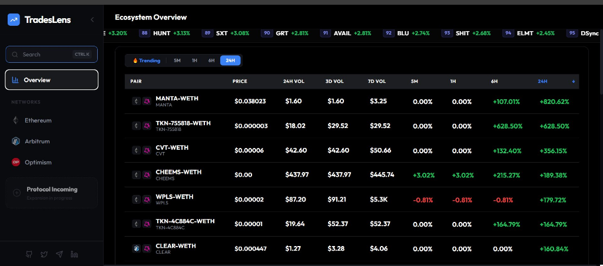

# TradesLens: DeFi Intelligence & Multi-Chain DEX Analytics Terminal

**TradesLens** is a high-performance, production-grade ELT (Extract, Load, Transform) data pipeline designed to ingest, transform, and analyze on-chain activity across multiple blockchains and Decentralized Exchanges (DEXes). 

By combining **Envio HyperIndex** for real-time event indexing, **PySpark** for scalable Extract & Load (EL) capabilities, and **dbt** for modern data modeling and transformations (T) on **Google BigQuery**, TradesLens provides unified, analyst-ready analytics of the DeFi DEX ecosystem.



---

### 💡 The Problem TradesLens Solves
Analyzing decentralized exchange data across different blockchains is highly complex due to:
* **Data Fragmentation:** Swap data is scattered across Ethereum, Optimism, and Arbitrum. Each chain uses different RPC nodes, blocks, and transaction patterns.
* **Lack of Standardization:** Event logs emit raw hex values, un-normalized decimals, and raw tick indices. Attributing chain names, matching token symbols, and standardizing decimal-adjusted volumes is highly tedious.
* **High Query Latency:** Querying live RPC nodes for aggregate metrics (such as 24-hour volume, price changes, or trending pools) is too slow for consumer-facing dashboards.

**TradesLens** solves this by indexing raw events instantly via Envio, storing them in the PostgreSQL database, loading them into Google Cloud Storage (GCS) using PySpark, and transforming them in **Google BigQuery** using **dbt**. Analysts and frontends can query standardized, pre-aggregated Gold tables (`fct_dex_swaps`, `price_changes`) in BigQuery in milliseconds.

---

### 🌟 Key Features
* **Multi-Chain Event Ingestion:** Real-time indexing of Ethereum Mainnet, Arbitrum, and Optimism.
* **Unified DEX Analytics:** Standardized models for Uniswap V3, SushiSwap V3, and Solidly V3 swaps and pools.
* **Hybrid Storage Architecture:** Uses **PostgreSQL** for ingestion storage and **Google BigQuery** for analytics at scale.
* **Medallion Data Lineage:** Clean division of data into Bronze (raw ingestion), Silver (standardized schemas, decimal normalization), and Gold (analyst-ready metrics).
* **Automated Orchestration:** Fully automated pipelines managed by **Apache Airflow**.

---

### 🛠 Tech Stack
| Tier | Technology | Description |
| :--- | :--- | :--- |
| **Ingestion** | [Envio HyperIndex](https://envio.dev/) | Ultra-fast multi-chain event indexing & factory monitoring |
| **Ingestion DB** | [PostgreSQL](https://www.postgresql.org/) | Database storage for raw event data written by Envio |
| **Data Lake** | [GCS (Google Cloud Storage)](https://cloud.google.com/storage) | Staging layer for raw event data |
| **Extract & Load (EL)** | [PySpark](https://spark.apache.org/) | Scalable extraction from PostgreSQL and loading to GCS & BigQuery |
| **Modeling** | [dbt-core](https://www.getdbt.com/) | BigQuery standard SQL transformations and data modeling |
| **Warehouse** | [Google BigQuery](https://cloud.google.com/bigquery) | Serverless, highly scalable enterprise data warehouse |
| **Orchestration** | [Apache Airflow](https://airflow.apache.org/) | DAG orchestration for Spark pipelines and dbt runs |
| **Intelligence API** | [FastAPI](https://fastapi.tiangolo.com/) | High-performance analytical backend for dashboard queries |
| **Frontend** | [React 19](https://react.dev/) + [Vite](https://vitejs.dev/) | Cinematic terminal UI with real-time charting |

---

### 📂 Project Structure
```text
├── Indexers/
│   └── Dex-Indexer/       # DEX Event Ingestion (Swaps, Pools) via Envio (writes to PostgreSQL)
├── model/                 # dbt project (Medallion Architecture)
│   ├── models/staging/    # Raw BigQuery data normalization
│   ├── models/intermediate/# Cross-chain & asset enrichment
│   └── models/marts/      # Analytical Fact Tables & aggregated price metrics
├── airflow/               # Orchestration layer (Airflow dbt DAGs)
└── dashboard/
    ├── backend/           # FastAPI Analytical API
    └── frontend/          # React 19 Cinematic Analytical Dashboard
```

---

### 🚀 Getting Started

#### 1. Environment Configuration
Create your environment file in the project directories:
```bash
cp .env.example .env
```
Ensure your database credentials and GCP service account configurations are correctly set.

#### 2. Run the Indexers
The indexers capture real-time chain events and store them in the PostgreSQL database:
```bash
cd Indexers/Dex-Indexer
docker-compose up --build
```

#### 3. Run the Ingestion (EL) Pipeline
To extract raw data from PostgreSQL and load it to GCS and BigQuery:
```bash
cd Indexers/load_to_GCP
# Run production ingestion
uv run python load_prod.py
```

#### 4. Run dbt Transformations
Compile and execute the analytical models in BigQuery:
```bash
cd model
# Validate SQL models compilation
uv run dbt compile --target prod

# Run transformations on BigQuery
uv run dbt run --target prod
```

#### 5. Data Orchestration (Airflow)
Airflow automates your transformations periodically:
```bash
cd airflow
# Initialize and start Airflow services
docker-compose up airflow-init
docker-compose up -d
```
Access the Airflow UI at `http://localhost:8080` (default: `airflow`/`airflow`).

#### 6. Start the Intelligence Dashboard
```bash
# Start Backend API
cd dashboard
docker-compose up --build backend

# Start Frontend
cd ../frontend
npm install && npm run dev
```

---

### 📊 Medallion Architecture Lineage
1. **Bronze (Raw Ingestion):** Envio captures logs from the chains and writes them directly to the **PostgreSQL** storage layer. 
2. **Bronze (Data Lake Ingestion):** PySpark runs incrementally, extracting records from PostgreSQL and loading them into GCP (**GCS** & **BigQuery**).
3. **Silver (Normalized):** dbt standardizes the schemas in BigQuery (casting types, parsing array fields, attributing chain names).
4. **Gold (Intelligence):** Unified analytical metrics (`fct_dex_swaps`, `price_changes`) structured in BigQuery for the FastAPI backend and dashboard.

---

### 🛡️ Contributors & Vision
TradesLens is built for transparency and deep on-chain visibility. 
* **Author:** Onah Innocent (Freeman)
* **X:** [@Freemandayly](https://x.com/freemandayly)
* **LinkedIn:** [Onah Innocent](https://www.linkedin.com/in/onah-innocent-69ba32112/)